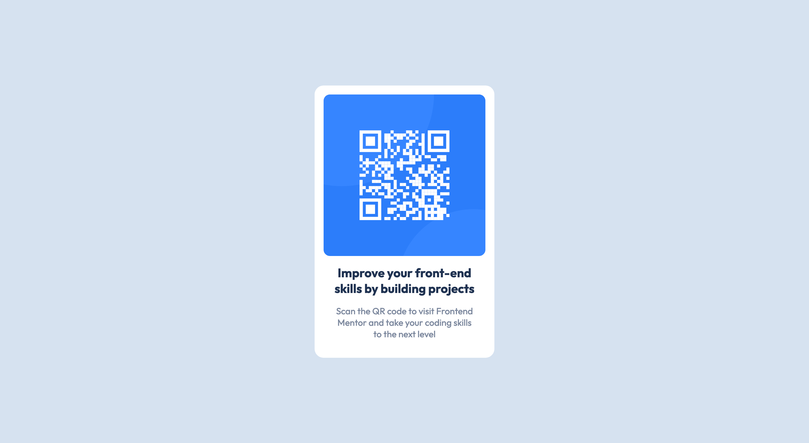

# Frontend Mentor - QR code component solution

This is a solution to the [QR code component challenge on Frontend Mentor](https://www.frontendmentor.io/challenges/qr-code-component-iux_sIO_H). Frontend Mentor challenges help you improve your coding skills by building realistic projects.

## Table of contents

- [Overview](#overview)
  - [Screenshot](#screenshot)
  - [Links](#links)
- [My process](#my-process)
  - [Built with](#built-with)
  - [What I learned](#what-i-learned)
  - [Continued development](#continued-development)
- [Author](#author)

## Overview

Build QR Code UI Component based on Design using HTML5 and CSS3

### Screenshot

### Links

- Solution URL: [QR Code Component Solution](https://www.frontendmentor.io/solutions/qr-code-component-using-html5-css3-Hyuv2Q6Vc)
- Live Site URL: [QR Code Component Live](https://frontendmentors-qrcode-o04cguv8p-r4mzn.vercel.app/)

## My process

- Use Mobile-first workflow by resizing preview width to 375px
- Identify the Structure
  - create main element that has card class. the element group card image, title and subtitle
- Working with styles
  - import the desired font
  - set base style
  - set card styles like max-width, padding, backgroundcolor, etc.
  - position the card to the center both horizontally and vertically by set the body element as a flex container and set both alignitems and justifycontent values to center
  - set card image styles
  - set card title styles
  - set card subtitle styles
  - Refactor styles
    - use custom properties / variables if needed

### Built with

- CSS custom properties
- Mobile-first workflow

### What I learned

Benefit of repetition to solidify the knowledge especially CSS.

### Continued development

Implement same idea maybe using preprocessor like SCSS, using different layouting technique like flexbox or grid

## Author

- Website - [Nazzal Ramzan Arifin](https://nazzalra.com)
- Frontend Mentor - [@r4mzn](https://www.frontendmentor.io/profile/r4mzn)
- Twitter - [@nazzalra](https://www.twitter.com/nazzalra)
